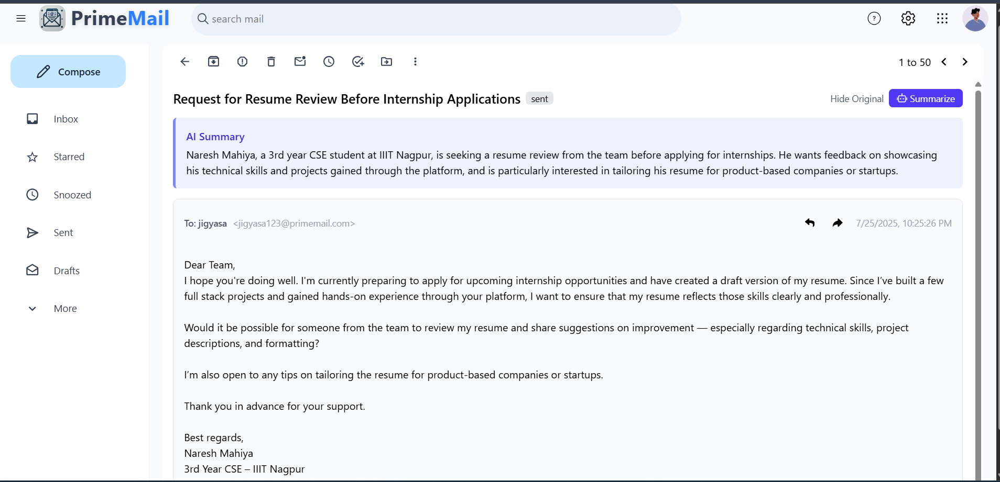

# PrimeMail - Modern Email Platform


PrimeMail is a modern, feature-rich email platform built with the MERN stack and AI capabilities. It provides a Gmail-like interface with advanced AI Powered email management capabilities and intelligent features to enhance productivity.

## ✨ Features

- **User Authentication**
  - Secure registration and login system
  - JWT-based authentication
  - Protected routes

- **Email Management**
  - Compose and send emails to multiple recipients
  - Rich text email composition
  - File attachments support
  - Inbox, Sent, and Starred folders
  - Email threading and conversations
  - Reply and forward functionality

- **User Experience**
  - Modern, responsive UI built with Tailwind CSS
  - Real-time email updates
  - Loading states and error handling
  - Toast notifications

- **AI-Powered Features**
  - AI Email Composition Assistant
  - Smart reply suggestions
  - Email summarization

## 🖥️ Screenshots

### Mail View & AI-summery 


### Sent Box


### AI composer


### Reply Mail


## 🚀 Tech Stack

### Frontend
- React 18 with Vite
- Redux Toolkit for state management
- React Router v7 for navigation
- Tailwind CSS for styling
- Framer Motion for animations
- React Icons and Lucide Icons
- Axios for API requests
- React Hot Toast for notifications
- React Avatar for user avatars

### Backend
- Node.js with Express.js
- MongoDB with Mongoose ODM
- JWT for authentication
- Cloudinary for file storage
- Nodemailer for email sending
- Bcrypt for password hashing
- Node-Cron for scheduling emails

### AI Integration
- OpenAI API for AI-powered features
- Natural language processing for email assistance
-
## 🏗️ Project Structure

```
primemail/
├── backend/                # Backend server code
│   ├── controllers/        # Request handlers
│   ├── db/                 # Database connection
│   ├── middleware/         # Express middleware
│   ├── models/             # Mongoose models
│   ├── routes/             # API routes
│   ├── scripts/            # Utility scripts
│   ├── utils/              # Helper functions
│   └── index.js            # Server entry point
│
├── frontend/               # React frontend
│   ├── public/             # Static files
│   └── src/                # Source code
│       ├── assets/         # Images and other assets
│       ├── components/     # React components
│       ├── hooks/          # Custom React hooks
│       ├── redux/          # Redux store and slices
│       ├── api.js          # API configuration
│       ├── App.jsx         # Main application component
│       └── main.jsx        # Application entry point
```

## 🚀 Getting Started


### Prerequisites

- Node.js (v16 or higher)
- npm (v8 or higher)
- MongoDB Atlas account or local MongoDB instance
- Cloudinary account (for file uploads)
- OpenAI API key (for AI features)

### Installation

1. Clone the repository
   ```bash
   git clone https://github.com/naresh-mahiya/primemail-email-plateform.git
   cd primemail
   ```

2. Set up the backend
   ```bash
   cd backend
   npm install
   cp .env.example .env
   # Update the .env file with your configuration
   ```

3. Set up the frontend
   ```bash
   cd ../frontend
   npm install
   cp .env.example .env
   # Update the .env file with your API endpoints
   ```

### Configuration

#### Backend (.env)
```
PORT=5000
MONGO_URI=your_mongodb_connection_string
JWT_SECRET=your_jwt_secret
JWT_EXPIRE=30d
CLOUDINARY_CLOUD_NAME=your_cloudinary_cloud_name
CLOUDINARY_API_KEY=your_cloudinary_api_key
CLOUDINARY_API_SECRET=your_cloudinary_api_secret
OPENAI_API_KEY=your_openai_api_key
```

#### Frontend (.env)
```
VITE_API_BASE_URL=http://localhost:5000/api
```

### Running the Application

1. Start the backend server
   ```bash
   cd backend
   npm run dev
   ```

2. Start the frontend development server
   ```bash
   cd frontend
   npm run dev
   ```

3. Open your browser and navigate to `http://localhost:5173`

## 📦 Deployment

The application is configured for deployment on Vercel (frontend) and Render/Railway (backend).

### Frontend Deployment

1. Push your code to a GitHub repository
2. Import the repository to Vercel
3. Set up environment variables in the Vercel dashboard
4. Deploy!

### Backend Deployment

1. Push your code to a GitHub repository
2. Create a new web service on Render/Railway
3. Set up environment variables
4. Deploy!

## 🤝 Contributing

Contributions are welcome! Please feel free to submit a Pull Request.

1. Fork the repository
2. Create your feature branch (`git checkout -b feature/AmazingFeature`)
3. Commit your changes (`git commit -m 'Add some AmazingFeature'`)
4. Push to the branch (`git push origin feature/AmazingFeature`)
5. Open a Pull Request

## 📄 License

This project is licensed under the ISC License - see the [LICENSE](LICENSE) file for details.

